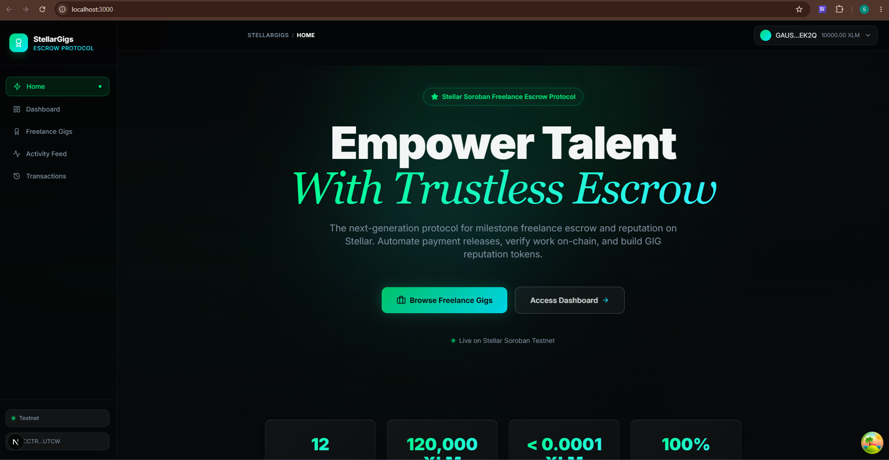
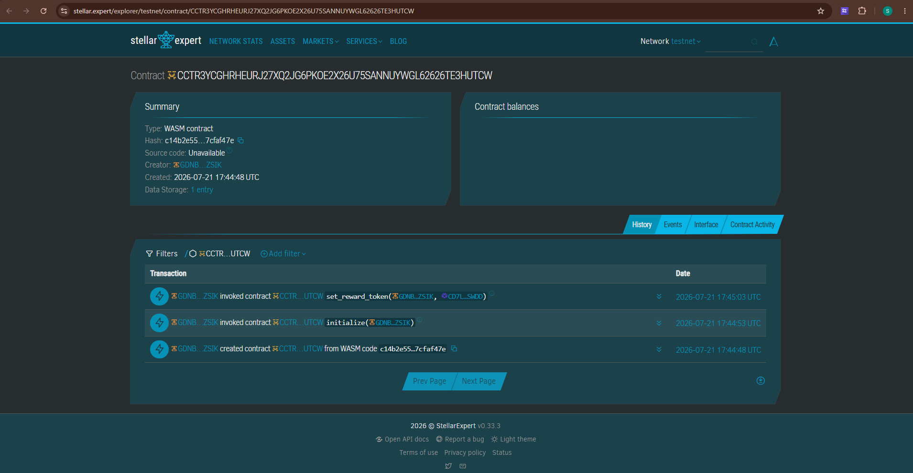

# StellarGigs — Decentralized Freelance Escrow & Reputation Protocol


StellarGigs is a next-generation milestone-based freelance marketplace and reputation protocol built on the Stellar blockchain using Soroban smart contracts. It enables trustless escrow between clients and freelancers, eliminating traditional platform commission fees, automated payment releases upon milestone verification, and GIG reputation token rewards.

---

## 🔗 Live Links & Demo

- **Live Web Application (Vercel Deployment)**: [stellar-gigs.vercel.app](https://stellar-gigs.vercel.app)
- **Demo Video Walkthrough**: [Watch on Google Drive](https://drive.google.com/file/d/1wkDNo_90Jb0cSxDnH_LIUDGSjtmQLqr0/view?usp=sharing)

---

## 📸 Screenshots & Previews

### Dashboard Interface


### Stellar Expert Explorer & Contract Verification


---

## 🌟 Key Features

- **Milestone Escrow Governance**: XLM funding is locked directly in Soroban smart contracts and disbursed to freelancers upon milestone approval.
- **GIG Reputation Token Minting**: On-chain 1:1 reward token minting (`GIG`) for every XLM escrowed, establishing verifiable freelancer and client reputation credentials.
- **Low Gas & Instant Settlements**: Powered by Stellar Soroban with sub-second finality and near-zero execution costs (< 0.0001 XLM per transaction).
- **Claim Escrow Refund**: Automated contract logic allowing freelancers/clients to claim full escrow refunds if gig milestones are unmet or expired.
- **High-End Cyberpunk UI**: Sleek dark-mode aesthetic featuring Neon Green & Cyber Cyan visual accents, glassmorphic containers, and smooth micro-animations.

---

## 🏗️ Architecture & Escrow Flow Diagram

```
 +------------------+             +-----------------------+             +-----------------------+
 |  Client / Poster |             | StellarGigs Contract  |             |  Freelancer / Applicant|
 +--------+---------+             +-----------+-----------+             +-----------+-----------+
          |                                   |                                     |
          |  1. create_campaign(gig)          |                                     |
          +---------------------------------->|                                     |
          |                                   |                                     |
          |                                   |  2. donate(amount XLM)              |
          |                                   |<------------------------------------+
          |                                   |                                     |
          |                                   |  3. Cross-Contract Mint             |
          |                                   +------------------------------------>| [ Receives GIG Token ]
          |                                   |                                     |
          |  4. withdraw() (Release Payment)  |                                     |
          +---------------------------------->|                                     |
          |                                   |  5. Transfer XLM Payment            |
          |                                   +------------------------------------>| [ Receives Escrow Funds ]
          |                                   |                                     |
          |                                   |  OR (If Expired):                   |
          |                                   |  refund() -> Refund XLM             |
          |                                   |<------------------------------------+
```

---

## 📋 Smart Contract Addresses & Environment

| Parameter | Value / Contract ID |
|---|---|
| **Stellar Network** | `testnet` |
| **RPC Endpoint** | `https://soroban-testnet.stellar.org` |
| **StellarGigs Contract ID** | `CCTR3YCGHRHEURJ27XQ2JG6PKOE2X26U75SANNUYWGL62626TE3HUTCW` |
| **GIG Reputation Token Contract ID** | `CD7LEJ4OYMD3WABRWTSARKGH6YDFWVHTGYUEF4NVOZDAACUH6R6JSWDD` |
| **Deployer Wallet Address** | `GDNBL6JTLRK3N6YQWT4QT5BPAJUIT3PKAWJZ6NZ3P3PSWEMZMTBDZSIK` |
| **Stellar Expert Explorer** | [View Contract on Stellar Expert](https://stellar.expert/explorer/testnet/contract/CCTR3YCGHRHEURJ27XQ2JG6PKOE2X26U75SANNUYWGL62626TE3HUTCW) |

---

## 🚀 WSL Ubuntu Compilation & Deployment Guide

To compile the Soroban smart contracts to WebAssembly (`.wasm`) and deploy them on Stellar Testnet from a WSL Ubuntu environment:

### Step 1: Install C Compiler & Build Tools
```bash
sudo apt-get update
sudo apt-get install -y build-essential
```
*Note: Installing `build-essential` provides the `cc` linker required for compiling Rust workspace crates.*

### Step 2: Install Node.js v20
```bash
curl -fsSL https://deb.nodesource.com/setup_20.x | sudo -E bash -
sudo apt-get install -y nodejs
```

### Step 3: Run Automated Smart Contract Build & Deployment
```bash
npm run deploy:contract
```

This automated deployment script will:
1. Compile `contracts/crowdfund` ➔ `target/wasm32-unknown-unknown/release/stellar_gigs.wasm`.
2. Compile `contracts/reward_token` ➔ `target/wasm32-unknown-unknown/release/reputation_token.wasm`.
3. Fund the deployer account via Stellar Friendbot.
4. Upload both WASM bytecode files to Stellar Testnet.
5. Create contract instances and execute inter-contract linking (`set_reward_token`).
6. Update `.env.local` and `README.md` with freshly generated contract IDs.

---

## 💻 Local Development Setup

```bash
# 1. Install dependencies
npm install --legacy-peer-deps

# 2. Run unit tests
npm test

# 3. Start Next.js development server
npm run dev
```

Visit `http://localhost:3000` to interact with StellarGigs locally.

---

## 📄 License

Distributed under the MIT License. See `LICENSE` for more information.
